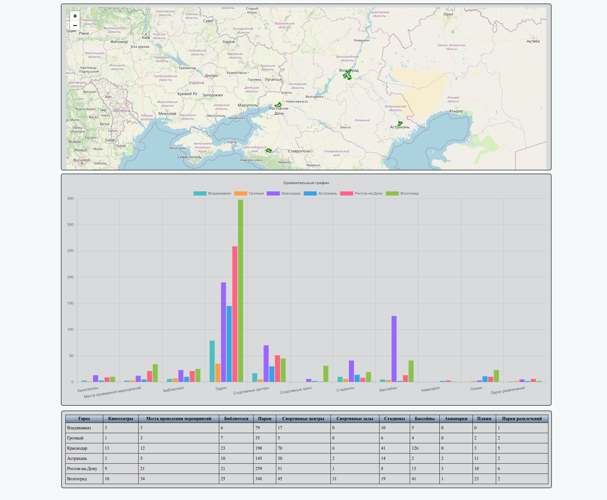

Bottle City Info — Интерактивная карта городов России
Проект на Python с использованием фреймворка Bottle для визуализации различных объектов (кинотеатры, парки, спортивные центры, библиотеки и др.) на интерактивной карте городов России. Данные получаются из OpenStreetMap через библиотеку OSMnx и отображаются с помощью Folium.



⚙️ Установка и запуск
```bash
git clone https://gitverse.ru/Rockdukan/bottle-city-info.git
cd bottle-city-info
uv venv
uv run main.py
```
